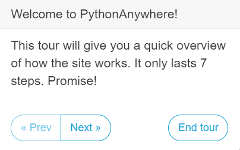
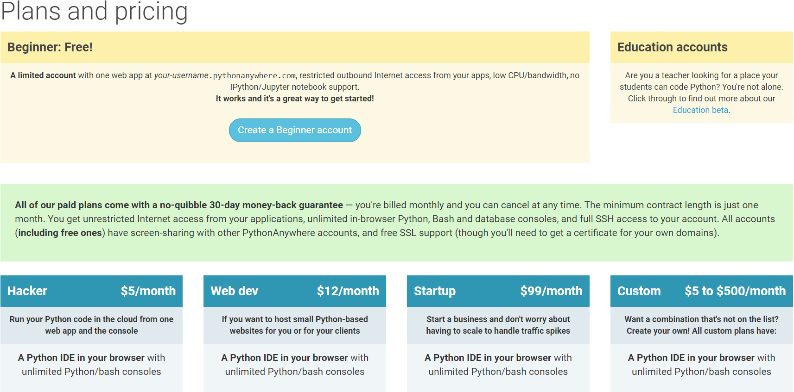

# 註冊帳號

1. 點擊前往[官網](www.pythonanywhere.com)
2. 點選右上角登入\(Log in\)
3. 點選註冊\(Sign up here!\)=&gt;也可以直接從此連結跳過前面步驟
4. 你會看到頁面的最下方圖片，看到時可能會嚇一跳，會有很多的方案，身為初學者的話，可以選擇免費方案，之後有需要功能，在付費升級也不遲 所以我們這邊直接選擇黃色標示中的\([Create a Beginner account](https://www.pythonanywhere.com/registration/register/beginner/)\)=&gt;可直接點擊超連結 
5. 記得申請時`username`，稍微思考一下，因為這會決定你的網站的網址， `username`.pythonanywhere.com，而且之後也不能更改
6. 決定好以後，就如同第一步驟，從官網右上角登入吧!
7. 登入帳號，會出現小視窗提示你是否要導覽如果不想看就按下End tour  
8. 
 

