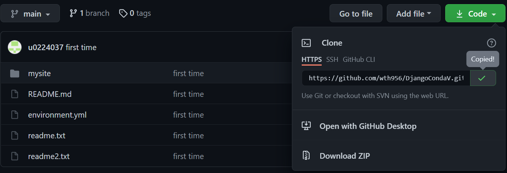

# 上傳Django資料夾

前言：文件教學都是參考DjangoDocument以及自身經驗，如果有不夠清楚也可以點擊超連結瀏覽。

首先，成功上傳完成後，打開github的repository，點選綠色按鈕Code，會出現一個小選單， \(預設\)會選擇Https，你只要將游標移到網址最後面，會有像記事本的圖案，按下之後會顯示Copied!。 




接著登入pythonanywhere，左下方會有一個藍色按鈕$Bash，按下去稍微等個幾秒鐘。

語法範例如下圖，這時我在這邊只要將複製的網址改成我們自己的，貼clone後面即可。  

```text
git clone https://github.com/myusername/myproject.git
```


